# SentinelX architecture

## Complete system

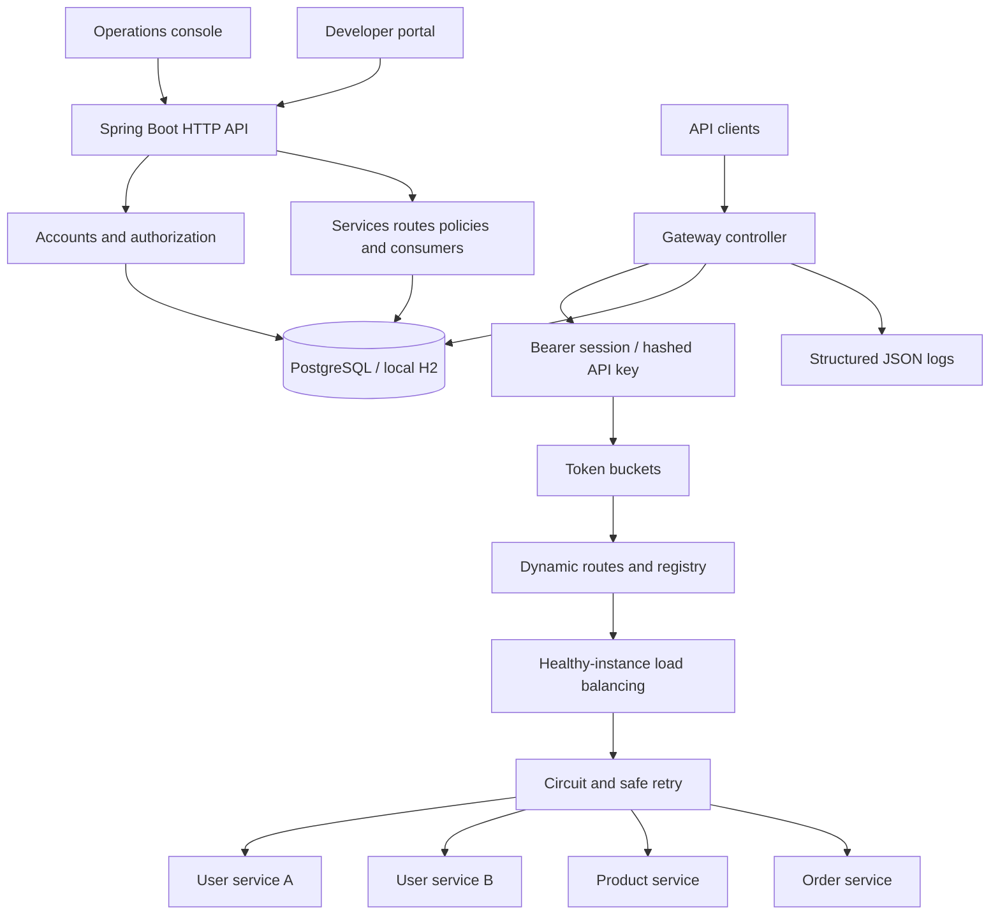

## Gateway request lifecycle

```mermaid
flowchart LR
    Request --> Correlation[Validate or generate request ID]
    Correlation --> Auth[Authenticate]
    Auth --> Access[Check account API access]
    Access --> Route[Resolve longest prefix and method]
    Route --> Quota[Evaluate applicable token buckets]
    Quota --> Healthy[Filter healthy and circuit-available instances]
    Healthy --> Reserve[Atomically reserve instance]
    Reserve --> Proxy[Bounded HTTP request]
    Proxy --> Release[Release reservation in finally]
    Release --> Response
    Response --> Persist[Record latency status retries and correlation]
```

## Authentication

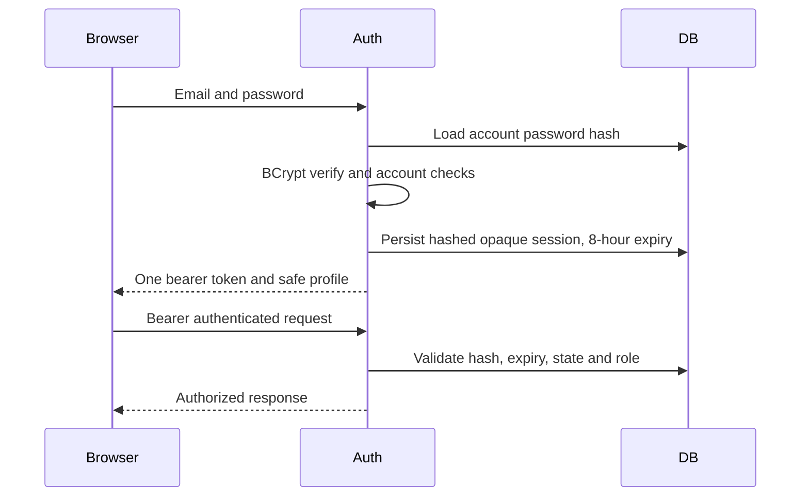

## Authorization

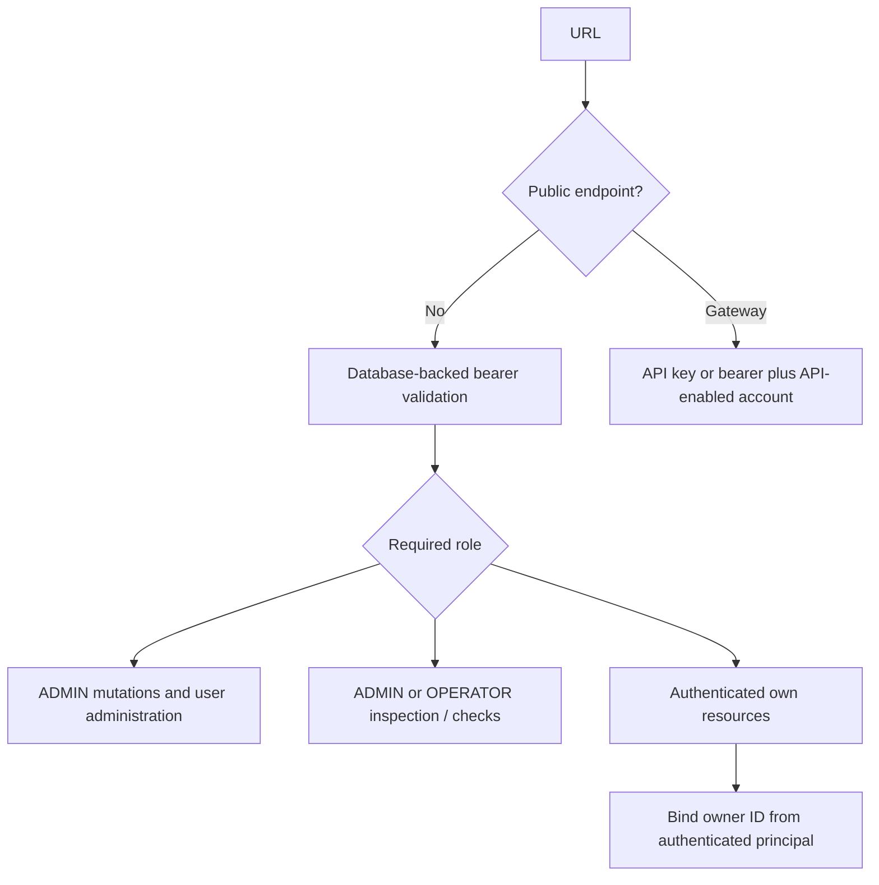

## Password reset

```mermaid
sequenceDiagram
    participant User
    participant API
    participant DB
    participant Mailbox as Local private mailbox
    User->>API: Forgot password email
    API->>DB: Invalidate old links; save hash and expiry
    API->>Mailbox: Deliver raw reset link locally
    API-->>User: Generic response
    User->>API: Token and confirmed new password
    API->>DB: Lock unconsumed unexpired token
    API->>DB: Hash password, consume links, revoke sessions
    API-->>User: Sign in again
```

## Service discovery and health

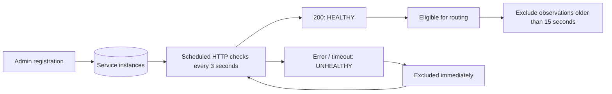

## Load balancing

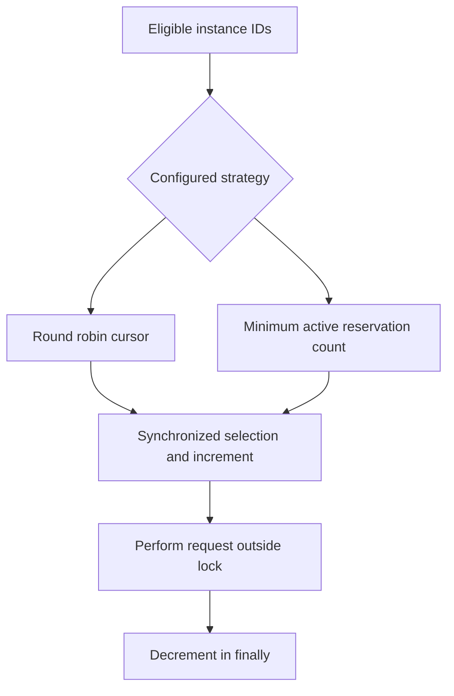

## Token bucket

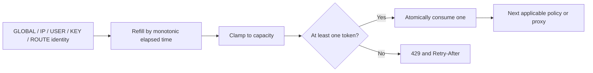

## Circuit breaker

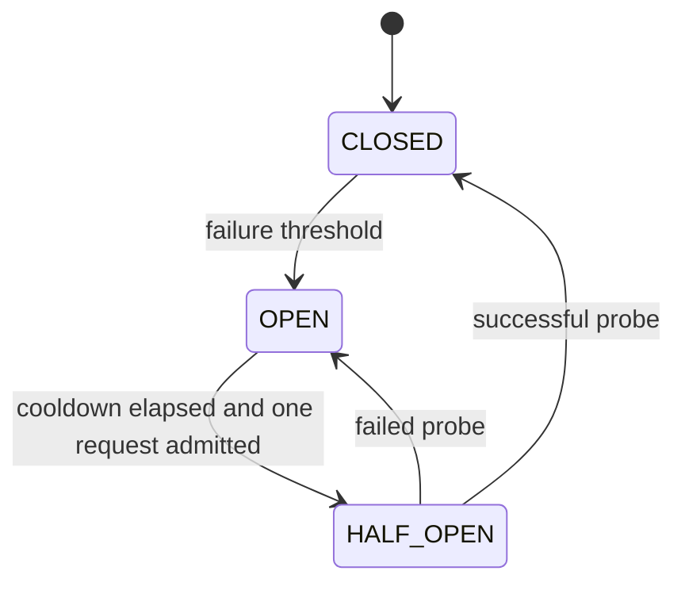

Each route/instance pair has its own circuit. Old in-flight completions carry a generation and cannot overwrite a later transition. An instance with an open circuit is filtered before selection; a concurrent race may still reject a selected probe.

## Retry

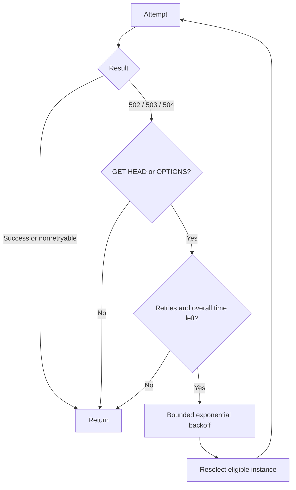

## Admin architecture

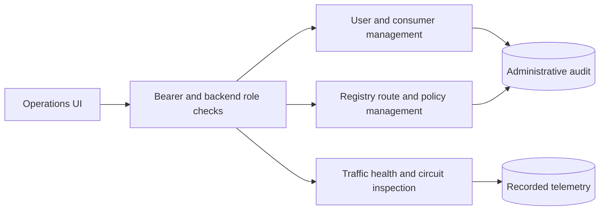

## Developer architecture

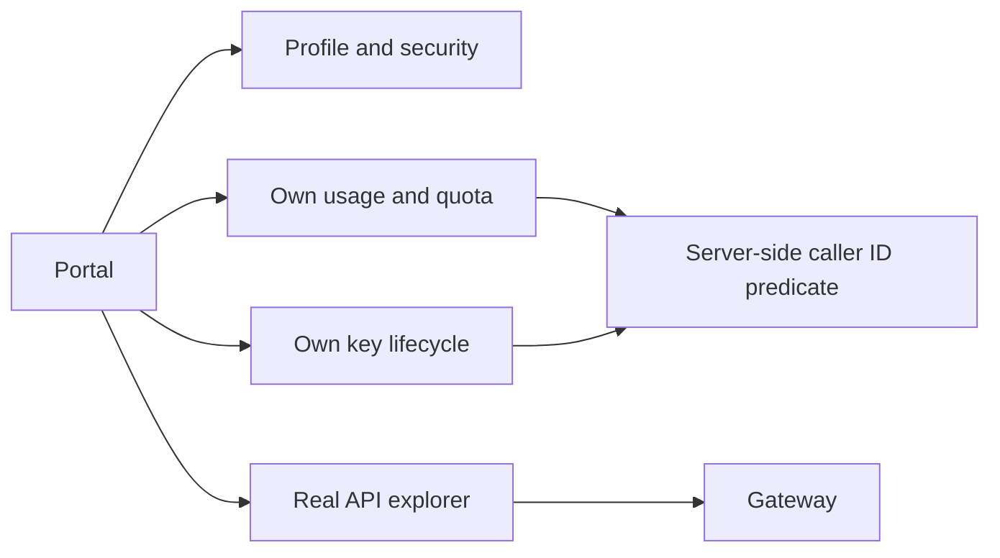

## Relational data model

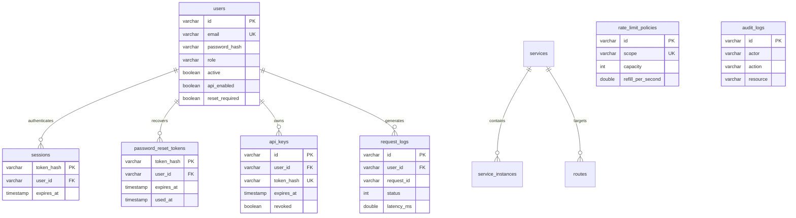

Roles are a constrained scalar because each account has one role. Retry and circuit policy fields belong to a route; separate tables would not add value without policy reuse. Key IDs in retained logs intentionally are not foreign keys, allowing lifecycle metadata to remain independent. Audit actor IDs are retained even if a future archival operation removes an account.

## Observability

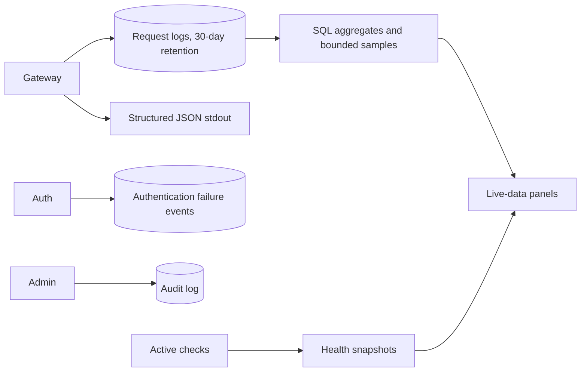

## Docker deployment

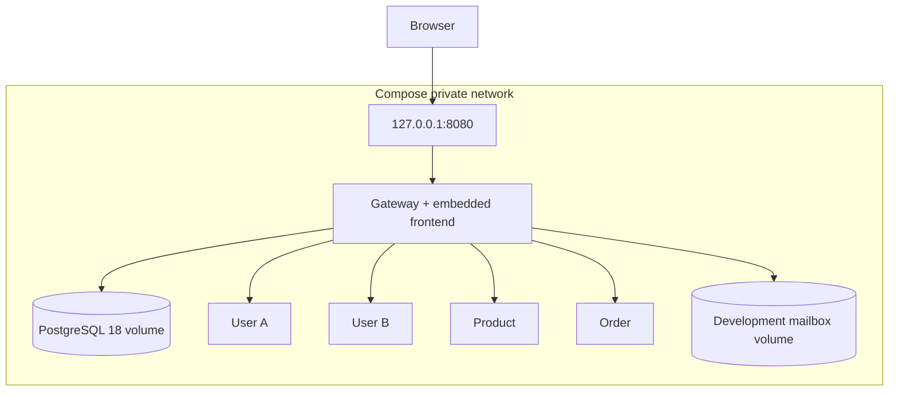

## Future AWS

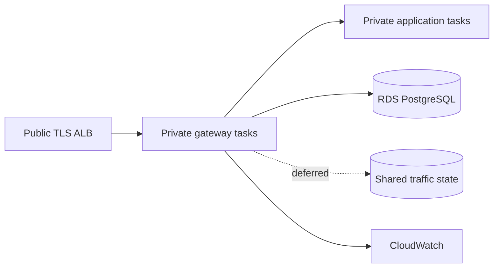

This final diagram is a future design, not an executed deployment. See the AWS runbook for the shared-state prerequisite before scaling gateway instances.
