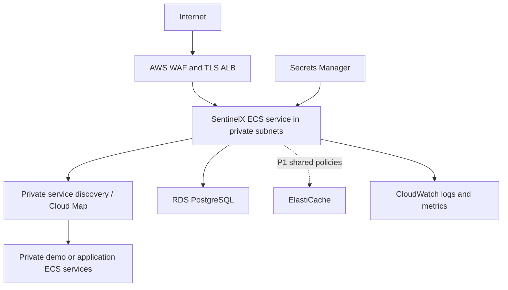

# Future AWS deployment design — not deployed

## Suggested deployment sequence

1. Build and scan immutable container images, pin tested image digests, and push to a controlled container registry. No registry push is performed by this project.
2. Provision an isolated VPC with public ALB subnets and private gateway/application/database subnets. Restrict security groups to ALB → gateway and gateway → approved downstream/database ports.
3. Create RDS PostgreSQL with TLS, encrypted storage, backups and restore procedures. Use a migration role separately from the application runtime role; run Flyway as a controlled deployment step.
4. Inject database credentials through Secrets Manager and task IAM roles. Never package secrets or public demo accounts in production images/configuration.
5. Adapt registry origin allowlists and DNS ownership to the private service discovery domain. Use health checks aligned with actual readiness, and restrict cloud metadata/network egress paths.
6. Configure TLS termination, forwarding-header trust, CSP and production password-reset email delivery. The current direct-IP limiter needs a reviewed trusted-proxy strategy behind ALB.
7. Ship structured logs to CloudWatch with explicit retention. Add actual Prometheus/OpenTelemetry integration if required; neither is implemented here.
8. Deploy a single gateway instance initially. Establish measured operating limits and overload behavior before scaling.

## Scaling constraint

Do not scale the gateway horizontally while claiming globally consistent token buckets, least-connections reservations or circuits. Those are in-memory in P0. First implement and test the P1 shared-state design (for example atomic Redis token buckets), define whether circuit isolation is per node or global, and measure multi-node failure behavior. Shared database sessions/configuration alone do not solve that coordination.

## Rollout and recovery

Use immutable revisions, readiness checks, staged rollout and rollback to a known image/configuration. Migrations must remain backward compatible during rolling upgrades. Test restore and failover against actual workload. Secrets rotation, budget alarms and operational runbooks must exist before public exposure.

This document describes an architecture and prerequisites. No AWS account, credentials, deployment, infrastructure-as-code execution or billable cloud resource was created.
